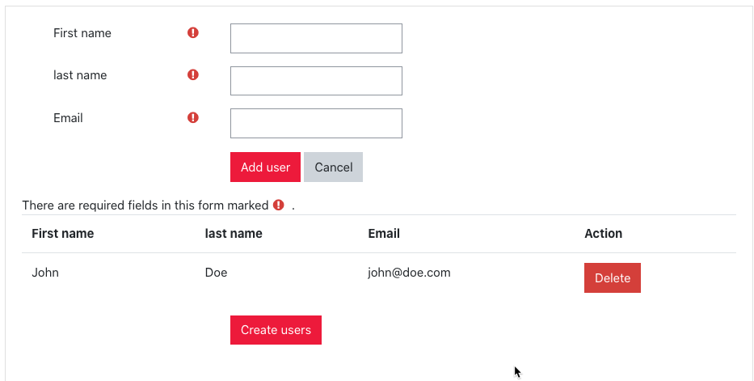
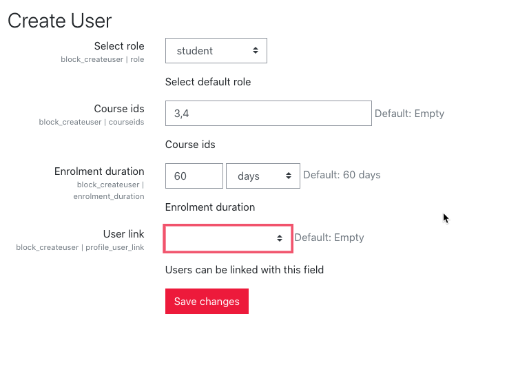

## Moodle - block createuser
This plugin allows a manager ("block/createuser:manager") to access a wizard to create new users on a user friendly way. 

## Wizard

## Author

* Author: Luuk Verhoeven, [MFreak.nl](https://MFreak.nl/)
* Min. required: Moodle 3.9
* Supports PHP: 7.2

## List of features
- Simple wizard for adding users to Moodle.
- Uses a task for creating users. 
- User friendly UI.
- Validation user exists.
- User moodle core functions.
- Mustache template.
- Can automatically enroll users to courses with a configurable role.
- Can add `createdby` (int) to a userprofile field.

## Installation
1.  Copy this plugin to the `blocks\createuser` directory on the server
2.  Login as administrator
3.  Go to Site Administrator > Notification
4.  Install the plugin
5.  You will need to fill out the settings.

## Security

If you discover any security related issues, please email [luuk@MFreak.nl](mailto:luuk@MFreak.nl) instead of using the issue tracker.

## License

The GNU GENERAL PUBLIC LICENSE. Please see [License File](LICENSE) for more information.

## Contributing

Contributions are welcome and will be fully credited. We accept contributions via Pull Requests on Github.
